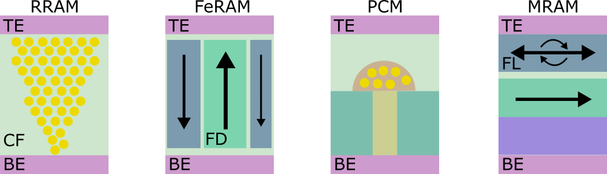
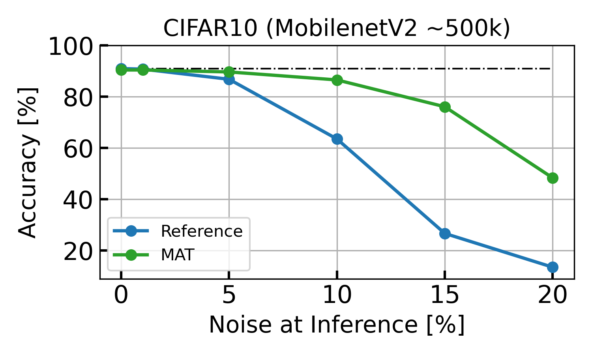

If you're here you probably already know what memristors are, but in case you don't: memristors are a novel class of electronic devices that exhibit interesting properties, among which the fact that they assume different resistance levels and are capable of holding their resistive state without requiring static power consumption. In a nutshell, they are non-volatile memories. Memristors can be made of different materials and, according to the physical principle they exploit, they are classified into the following main categories: Resistive-Random-Access-Memories (RRAMs) [1,2], and Ferroelectric-RAMs (FeRAMs) [3,4], Phase-Change-Materials (PCMs) [5], and Magnetic-RAM (MRAM) [6].


======

### Are memristors any good?
Yes, definitely! For the following reasons:

- Small cell size → high integration density
- Multi-level states* → high memory density
- Non-volatility → (virtually) zero static power consumption

*except for MRAMs, which are binary devices

In particular, memristors can be arranged in arrays and enable efficient In-Memory Matrix-Vector Multiplication (MVM). Weights from a matrix W can be mapped onto the conductances G in the memristive array and the inputs X is presented as voltages V at the rows of the array. Exploiting Ohm's and Kirchhoff's laws, the current at the columns I compute the MVM's output Y=WX. If you know anything about Neural Networks, you'll be aware that MVM operations are at the very core of Neural Network computation. That's where all the hype for memristive systems for Artificial Intelligence stems from!

 with a memristive array (right). Each weight in matrix W can be mapped to a conductance G in the memristive array.")
======

### Is there a catch with memristors?
Well, yes, memristors also have their issues.

The main issue of memristors is their *variability*. What does it mean? Imagine you have 100 memristors and you program them with the same programming conditions and you look at their state. You will observe a distribution of resistance levels, due to the so-called '*device-to-device*' variability. Furthermore, if you were to program the same single device 100 times, you will also observe a distribution of resistances, due to the '*cycle-to-cycle*' variability. If you were to measure the state of a memristor over time, you might see its resistive level oscillate or even drift, due to '*read-to-read*' noise, '*random-telegraph-noise*', and potentially even '*thermal-drift*'. Long story short, memristors suffer from variability and noise which makes it hard to precisely control their resistance. Despite Neural Networks can tolerate some slight imprecisions in their weights, the amount of variability introduced by memristors generally disrupts Neural Networks' performance.

Notice that the variability in RRAMs is in the [5–15]% interval, considering the mean resistance over the standard deviation. Other memristive technologies report similar levels of variability.

 RRAM device-to-device variability after programming 4096 devices with the same programming conditions. HCS stands for High-Conductive-State. b) Measurement of cycle-to-cycle variability. The "Current" x-axis refers to the programming condition. From [7].")
======

### Is there a fix for memristors' variability?
Yes, in the form of Memristive-Aware-Training! :)

The trick is to introduce the noise of the devices **while training**, so for the network to get used to the variability of memristors. Practically, such a training scheme aims at avoiding narrow valleys of the loss function and finding a flatter local minimum, where the perturbations due to memristors variability create fewer problems. How to introduce noise during training? With the Straight-Through-Estimator function! It's a common technique for training quantized/binarized neural networks and it consists in decoupling the weight matrices used for the forward and backward pass. In this way, one can use noisy memristive weights for inference and perform the weight update on the original unperturbed weights. To do this, all it takes is a simple function that needs to be added to the forward pass of your neural network model. In PyTorch, this can be implemented as follows:

```
# STE function to apply noise in the forward pass
class Noisy_Inference(torch.autograd.Function):
    """
    Function taking the weight tensor as input and applying gaussian noise with standard deviation 
    (noise_sd) and outputing the noisy version for the forward pass, but keeping track of the 
    original de-noised version of the weight for the backward pass
    """
    noise_sd = 1e-1

    @staticmethod
    def forward(ctx, input):
        """
        In the forward pass we add some noise from a gaussian distribution
        """
        ctx.save_for_backward( input )
        weight = input.clone()
        # registering the span of weight values
        delta_w = 2*torch.abs( weight ).max()
        # noise tensor to be applied to the weights
        noise = torch.randn_like( weight )*( Noisy_Inference.noise_sd * delta_w )
        return torch.add( weight, noise )

    @staticmethod
    def backward(ctx, grad_output):
        """
        In the backward pass we simply copy the gradient from upward in the computational graph
        """
        input, = ctx.saved_tensors
        weight = input.clone()
        return grad_output
noiser = Noisy_Inference.apply

# Application of the STE to a linear layer
# out_noisy = torch.nn.functional.linear( input, noiser(weight), noiser(bias) )
```

> **Does Memristor-Aware-Training work?** Yes, it does! Look at the results.

As discussed, Memristor-Aware-Training (MAT) helps Neural Networks find a configuration of weights that is resilient to their perturbation. It's very similar to the Quantization-Aware-Training technique [8], where the models' parameters are quantized during training to mitigate the performance loss due to the quantization of weights for deployment in resource-constrained (limited bit precision) hardware. In the same way, MAT makes the Network resilient to the noise and variability of memristors. Check out the effect of MAT on the very common MNIST handwritten digit recognition task, under different weight perturbation levels. In the example below, weights are perturbed both in training and in testing with Gaussian distributions with standard deviation normalized by the maximum weight magnitude (and reported as a percentage). The training noise standard deviation is 20%.

 on MNIST under different weight perturbation magnitudes during Inference. Reference is trained without the noise injection, while MAT is trained with 20% noise injection.")

So how does MAT work? 

It's really simple, all it takes is to follow these steps:

- Pre-training without noise
- Activating the noise injection function on your model
- (Re-)Training with noise injection
- Deployment on memristive hardware :)

This exact methodology has been adopted for very successful early implementations of Deep Neural Networks on memristive substrates, resulting in high-impact factor journal publications:

→ NeuRRAM [9]: an RRAM-based accelerator demonstrated with a ResNet-20 on CIFAR10, with >88% accuracy on-chip.
→ Joshi, Vinay, et al. "Accurate deep neural network inference using computational phase-change memory." Nature Communications 11.1 (2020): 2473. [10] Where a ResNet-32 reaches 71.6% accuracy on Imagenet.

With a similar methodology, MAT is demonstrated in simulation with a MobileNet-V2 network on the CIFAR10/100 tasks, with the following results.




Notably, the technique described above is not the only one proven successful to deploy Neural Networks on memristive substrates. A solution is proposed in [11], accounting for memristive non-linearity in the training phase, while [12] introduces noise during training with Bayesian-optimized dropout layers. Possibly, these techniques could be complementary and might even be combined with the Memristor-Aware-Training to yield better results.
This post aims at spreading knowledge about the Memristor-Aware-Training technique to promote the development of memristive systems for artificial intelligence, which offer great potential in being a disruptive technology for edge-AI applications. For this reason, the code to obtain the results shown in this post is shared on the following GitHub page, belonging to the EIS group.

Visit the [Memristor-Aware-Training GitHub repo](https://medium.com/r?url=https%3A%2F%2Fgithub.com%2FEIS-Hub%2FMemristor-Aware-Training.git).

Also check out the Emerging Intelligent Substrates Lab (EIS), directed by Melika Payvand. It's a cool environment where novel memristive-based architectures and neuromorphic algorithms are codesigned, leading to creative and competitive neuromorphic solutions.

Visit the [EIS Lab Github](https://github.com/EIS-Hub).

=====

### References
[1] Wong, H-S. Philip, et al. "Metal–oxide RRAM." Proceedings of the IEEE 100.6 (2012): 1951–1970.

[2] Kim, M. J., et al. "Low power operating bipolar TMO ReRAM for sub 10 nm era." 2010 International Electron Devices Meeting. IEEE, 2010.

[3] Mikolajick, Thomas, et al. "FeRAM technology for high density applications." Microelectronics Reliability 41.7 (2001): 947–950.

[4] L. Grenouillet et al. "Performance assessment of BEOL-integrated HfO 2-based ferroelectric capacitors for FeRAM memory arrays". In: 2020 IEEE Silicon Nanoelectronics Workshop (SNW). IEEE. 2020, pp. 5–6.

[5] Ielmini, Daniele, et al. "Physical interpretation, modeling and impact on phase change memory (PCM) reliability of resistance drift due to chalcogenide structural relaxation." 2007 IEEE International Electron Devices Meeting. IEEE, 2007.

[6] Na, Taehui, Seung H. Kang, and Seong-Ook Jung. "STT-MRAM sensing: a review." IEEE Transactions on Circuits and Systems II: Express Briefs 68.1 (2020): 12–18.

[7] Dalgaty, Thomas, et al. "In situ learning using intrinsic memristor variability via Markov chain Monte Carlo sampling." Nature Electronics 4.2 (2021): 151–161.

[8] Jacob, Benoit, et al. "Quantization and training of neural networks for efficient integer-arithmetic-only inference." Proceedings of the IEEE conference on computer vision and pattern recognition. 2018.

[9] Wan, Weier, et al. "A compute-in-memory chip based on resistive random-access memory." Nature 608.7923 (2022): 504–512.

[10] Joshi, Vinay, et al. "Accurate deep neural network inference using computational phase-change memory." Nature Communications 11.1 (2020): 2473.

[11] Joksas, Dovydas, et al. "Nonideality‐Aware Training for Accurate and Robust Low‐Power Memristive Neural Networks." Advanced Science 9.17 (2022): 2105784.

[12] Ye, Nanyang, et al. "Improving the robustness of analog deep neural networks through a Bayes-optimized noise injection approach." Communications Engineering 2.1 (2023): 25.